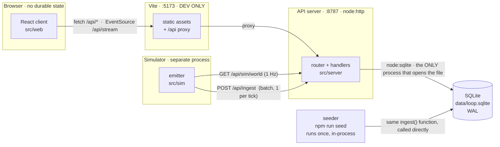
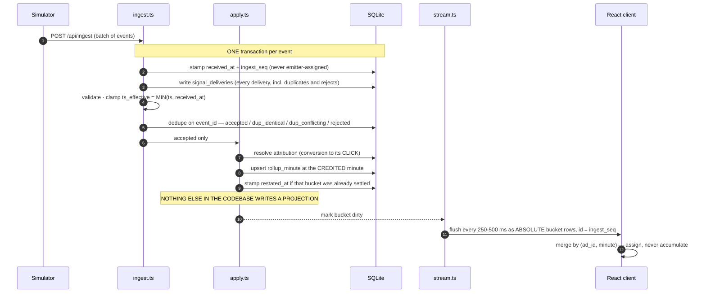
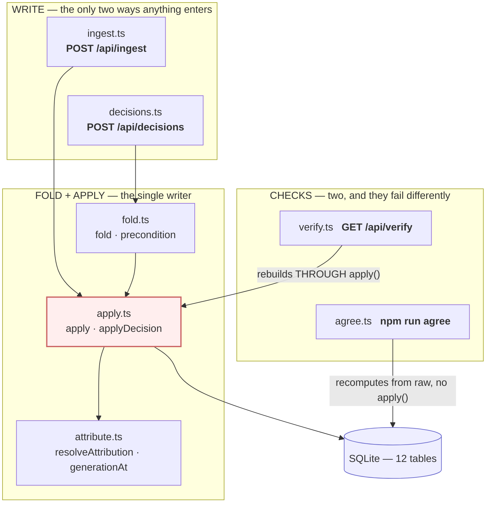
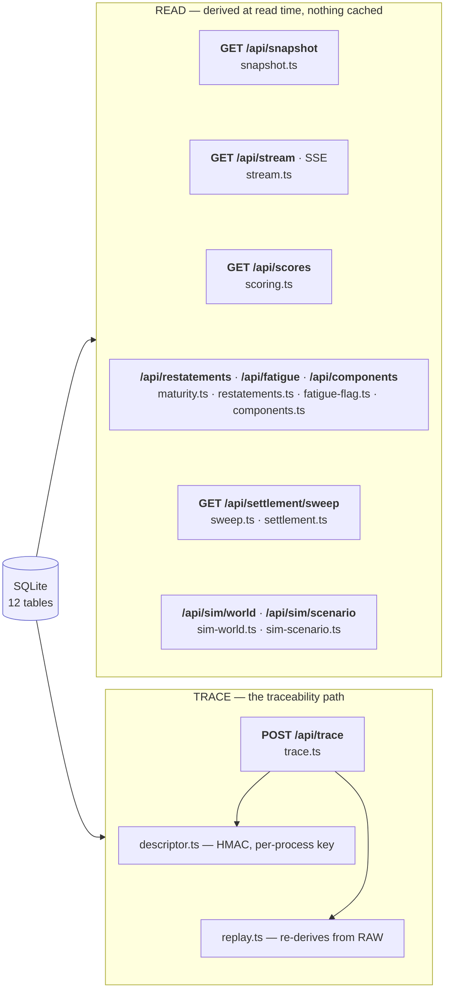
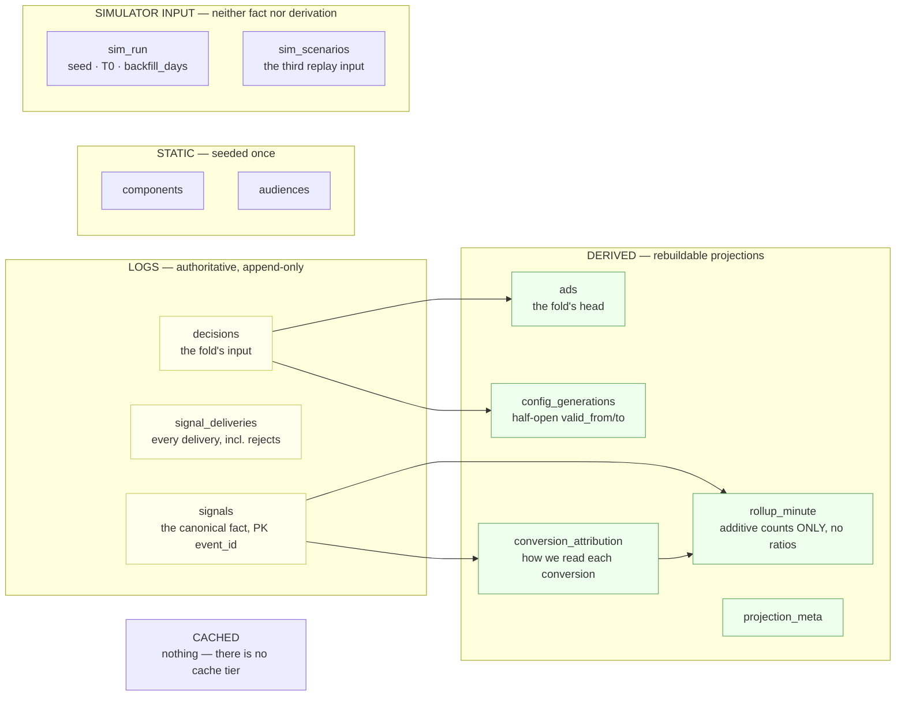
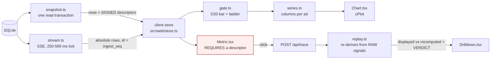
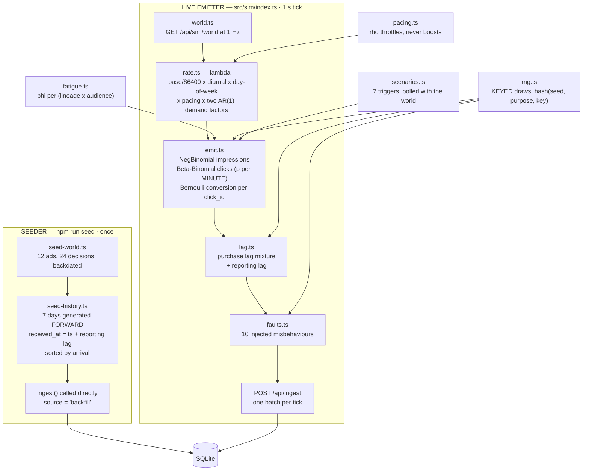

# ARCHITECTURE.md — the whole system, in pictures

**What this file is for.** [`DESIGN.md`](DESIGN.md) argues the design and [`README.md`](../README.md)
explains the choices; both are prose. This is the map: three processes, eighteen endpoints, twelve
tables and one write path, drawn rather than described.

Every diagram below was derived from the source — the endpoint list from `src/server/index.ts`, the
tables from `sqlite_master`, the module roles from their own exports — not from recollection. The
diagrams are **Mermaid**, so they render on GitHub, they need no dependency (**CLAUDE.md** §5), and
they diff line by line, which a PNG does not.

**If you read one diagram, read [§2, the write path](#2--the-write-path-one-event-to-a-pixel).** It
is the property the whole design exists to demonstrate.

---

## 1 — Three processes, and what crosses each boundary

`npm start` runs all three. Nothing is containerised and nothing needs to be.

**The three boundaries, and why each is where it is:**

| Boundary | Rule | Decision |
|---|---|---|
| Browser → server | The client owns **nothing durable** — no `localStorage`, no IndexedDB. Closing the tab loses which ads were selected, and nothing else. | **D8** |
| Simulator → server | The simulator **never opens the store.** It reaches it only over HTTP, through the same `POST /api/ingest` every event goes through, so there is exactly one owner of `ingest_seq`. | **D32** |
| Vite → nothing | Vite is **dev-time only** and absent from the running system. The client fetches relative paths, so the same code works behind the proxy and behind the Node server directly. | **D41** |

The seeder is the one thing that bypasses HTTP — it calls `ingest()` in-process because it writes
1.6M events and a per-event round trip would take hours. It is a **fixture writer, not an emitter**,
and the `source` column keeps the two populations apart (**E15**).

---

## 2 — The write path: one event to a pixel

This is the diagram that matters. **One transaction, and exactly one function may write a
projection.**

**Four properties fall out of that shape, and each is a decision rather than an accident:**

- **A late conversion is not a special case.** It is an event whose bucket happens to be old, so
  restatement is a flag and a fan-out rather than a subsystem (**D29**).
- **The wire carries absolute rows, not deltas** (**D30**), so a redelivery after a reconnect is
  idempotent and *"the number grew"* and *"the number changed"* are one mechanism.
- **A reader never sees a signal its bucket does not include**, because the rollup upsert is in the
  same transaction as the insert.
- **`apply()` is the only projection writer** (**D7**). The live path calls it with one new fact; the
  rebuild path calls it with the whole log from zero. Because they are the same function,
  *"drop every projection, replay, get identical numbers"* is runnable rather than asserted.

---

## 3 — The server, by role

Eighteen endpoints over a ~40-line router on `node:http` (**D42**). No framework.

**Two figures, because one was unreadable.** The write side and the read side share only the store,
so they are drawn separately — see the note at the end of this section for the measurement that
forced the split.

### 3a — The write side, and the single writer

**Read the red box as the invariant.** `apply.ts` is the only module that writes `ads`,
`config_generations`, `conversion_attribution` or `rollup_minute`. `/api/verify` rebuilds *through*
it into `TEMP` tables shadowing the real names (**D55**), which is why it catches a **drifted store**;
`npm run agree` re-derives the rollups *without* it, which is why it catches **wrong code**. Two
checks, two failure modes, and hand-editing one `rollup_minute` row trips both.

**The two check arrows are drawn differently on purpose.** `verify.ts` imports `apply.ts`
(`verify.ts:29`) — a real call, so its arrow lands on the red box. `scripts/agree.ts` **imports
nothing at all**: it is 200 lines that read raw `signals` and recompute, which is why its arrow goes
to the store and not to any module. Its own header says why, in bold — *"ONE ORDERED WHOLE-LOG PASS.
NOT `replay()` PER BUCKET … the logic is shared with `replay()` in kind, not by call."* An earlier
version of this diagram drew `agree.ts → replay.ts`, which asserted precisely the call the code
refuses to make, and undercut the one property that makes a second check worth having.

### 3b — The read side, and the trace path

**Every box in `READ` reads the store and nothing else** — no cache, no materialised view, no
shared in-memory state between requests. That is what makes `/api/verify` and `npm run agree`
meaningful: there is no third copy of a number for them to miss. `trace.ts` is the only read path
that also *writes* nothing but proves something — it verifies the descriptor's HMAC, then re-derives
the answer from raw through `replay.ts` (the only module that imports it).

### Why this is two figures and not one

**Measured, not judged.** GitHub caps a rendered Mermaid diagram at the width of the markdown body
(~860 px), so a diagram wider than that is scaled down and its labels shrink with it. Rendered
against mermaid 11 in headless Chrome at an 860 px container:

| Version | Natural width | Scale | Effective label size |
|---|---|---|---|
| The single `flowchart LR` this replaced | **3,582 px** | 0.24 | **3.8 px** |
| 3a — the write side | **763 px** | **1.00** | **16 px** |
| 3b — the read side | **641 px** | **1.00** | **16 px** |

Seventeen nodes in five role groups cannot be laid out under 860 px in one figure: the best
single-figure arrangement measured 1,061 px and 13 px. Split, both halves render at their natural
size and nothing is scaled at all. Nothing was dropped to get there — all seventeen modules and both
labelled check edges survive, and the endpoint paths are on the nodes rather than only in the table
below.

### The endpoints, in full

| Method | Path | What it is for |
|---|---|---|
| `POST` | `/api/ingest` | The one way a signal enters. Stamps, validates, dedupes, applies — one transaction |
| `POST` | `/api/decisions` | The one way config changes. A lever appends a row; the fold does the rest |
| `GET` | `/api/decisions` | The decision log |
| `GET` | `/api/snapshot` | One window in one read transaction, with signed descriptors. `?include=totals` adds the headline |
| `GET` | `/api/stream` | SSE. Absolute bucket rows, `id:` = high-water `ingest_seq`, `Last-Event-ID` resume |
| `GET` | `/api/scores` | Decision scoring, `?window_h=` and `?horizon_h=` as read parameters |
| `GET` | `/api/restatements` | Settled buckets that moved, at the bucket's own time |
| `GET` | `/api/fatigue` | The one heuristic: `(lineage × audience)` pairs losing click-through |
| `GET` | `/api/components` · `/usage` | The library, and the reverse join — *"used in N ads right now"* |
| `GET` | `/api/settlement/sweep` | Re-evaluate settlement at a shortened horizon. Writes nothing |
| `POST` | `/api/trace` | Walk a number back. Verifies the descriptor's HMAC, re-derives from raw |
| `GET` | `/api/trace/event` | One event, end to end — emission to pixel |
| `GET` | `/api/verify` | Rebuild every projection into `TEMP` shadows and hash-compare |
| `GET` | `/api/sim/world` | What the simulator polls at 1 Hz: live ads, their config, the seed, `T0` |
| `POST` `GET` | `/api/sim/scenario` | Fire a scenario; read the replayable record of every trigger |
| `GET` | `/api/health` | Log position, store path, schema version, subscriber count |

---

## 4 — The store: four categories, twelve tables

The brief asks *"what's a table, what's a log, what's derived"*. It is four, and the fourth is the
interesting one. Full DDL in [`SCHEMA.md`](SCHEMA.md).

**Why `conversion_attribution` is its own table rather than three nullable columns on `signals`:** a
late click changes the *interpretation* of a conversion, and if the interpretation lived on the log
row we would be mutating the log. A signal row records what a delivery said; every reading of it is
derived and disposable.

**`rollup_minute` stores only additive counts** — impressions, clicks, `click_cost_cents`,
`spend_cents`, conversions, `value_cents` — and **every ratio is divided at read time** (**D10**).
Ratios do not aggregate; their numerators and denominators do.

---

## 5 — The read path, and why the client cannot cheat

**Three layers stop the client inventing a number, and only the third runs at runtime:**

1. **`Display` types in `wire.ts`** — the raw tail arrives as pre-rendered strings, so nothing on
   that surface can be summed into a metric (**D34**).
2. **`<Metric>` requires a `TraceDescriptor`** whose `sig` is a branded `Signature` produced by
   exactly one function — `sign()` in `descriptor.ts`, which does not exist in the browser bundle.
   A number the client invented has no descriptor it can be rendered with, and it will not compile.
3. **`POST /api/trace` verifies the HMAC.** A forged descriptor reads `invalid_signature` on screen
   rather than returning a number.

The key is **32 random bytes minted per server process** unless `TRACE_KEY` is set, so descriptors
do not survive a restart — and do not need to, because every one is re-issued on the next
`/api/snapshot`, which the client re-runs on refresh, reconnect and window change. *(This is why
running two servers against one store makes the page read `invalid_signature`.)*

---

## 6 — The simulator: a model, not a fixture

Two entry points, one rate model, and **one function** serving both populations of clicks.

**The three things worth understanding about it:**

- **Draws are keyed, not sequential** — `hash(seed, purpose, key)`. That is what lets a restarting
  emitter re-derive a click's entire future from its `click_id` alone, which is what makes the
  restart demo free: re-emitted seconds land as `duplicate_identical` and move no number.
- **It holds no durable state** (**D40**). Without a successful world poll it emits *nothing at all*
  — which is why pausing an ad stops its events within one tick.
- **Fatigue and novelty enter `p_ctr`, never λ** (**D56**). They change what an impression is
  *worth*, never how many arrive. Putting them in both would charge fatigue twice, as `φ²`.

Reproducibility is `(seed + decision log + sim_scenarios) → world`, and all three inputs are in the
store — which is why `sim_scenarios` is a table rather than a message.

---

## 7 — Three clocks, and which one the screen shows

Worth stating plainly, because two of them are easy to confuse and the third is invisible until you
demo from another timezone.

| Clock | Where it applies | Why |
|---|---|---|
| **UTC** | Everything stored, everything on the wire, and **every clock rendered on screen** | `minute_start` is UTC (**D28**), every window bound and `as_of` is an ISO `Z` string, and those are the strings a reviewer pastes into a trace. One zone is the only way *"does this number match that event?"* is answerable |
| **`America/New_York`** | Exactly two things: the day boundary at which `daily_budget_cents` resets, and the turn of the simulator's diurnal curve | **D22** — with US audiences a UTC day would roll the budget mid-afternoon-peak and the discontinuity would be an artifact of our clock rather than a property of the domain |
| **The browser's** | **Nothing** | It rendered the chart axis and the restatement timeline until a UTC+4 machine showed that put a four-hour gap between the axis and the generation marker drawn on it (**D76**) |

The consequence of the middle row is visible and named: on a UTC axis, midnight New York shows up at
**04:00** (EDT). That is the budget reset, four hours into the chart's day, and it is a stated limit
rather than a bug.

---

## 8 — Where to look in the code

| I want to understand… | Read |
|---|---|
| How an event becomes a number | `src/server/ingest.ts` → `apply.ts` |
| Why a conversion lands in an old bucket | `src/server/attribute.ts`, and `DESIGN.md` §5 |
| How config is derived from levers | `src/server/fold.ts` |
| How a number is walked back | `src/server/trace.ts` + `replay.ts` + `descriptor.ts` |
| The two independent checks | `src/server/verify.ts` and `scripts/agree.ts` |
| The statistical gate | `src/web/gate.ts` (shared with the server's fatigue flag) |
| The rate model | `src/sim/rate.ts`, then `params.ts` for every constant |
| What the numbers actually did | [`MOCK_DATA.md`](MOCK_DATA.md) — designed curves against the shipped world |

**Nothing writes a projection except `apply()`.** If you change one thing in this repo, let it not be
that.
